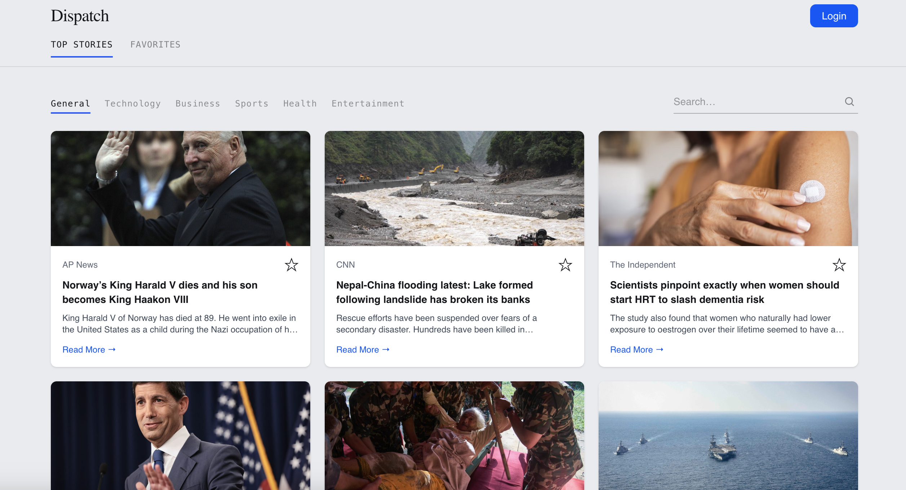

# 📰 News Dashboard

A full-stack news dashboard built with Next.js, where users can browse real-time news by category, search topics, and save favorite articles to their personal account.

**🔗 Live demo:** [blanca-news-dashboard.vercel.app](https://blanca-news-dashboard.vercel.app)



## Features

- 🔍 **Search & browse** news by category (Technology, Business, Sports, Health, Entertainment) or free-text search
- 🔐 **Google OAuth authentication** — secure sign-in with account picker
- ⭐ **Save favorites** — logged-in users can save articles to their own collection, backed by a real database
- 📱 **Responsive design** — works cleanly on mobile, tablet, and desktop
- 🔒 **Protected routes** — the favorites page is only accessible to authenticated users
- 🎨 **Custom design system** — editorial-inspired UI with a distinct visual identity, not a default template

## Tech Stack

**Frontend**
- [Next.js 16](https://nextjs.org/) (App Router)
- [React 19](https://react.dev/)
- [TypeScript](https://www.typescriptlang.org/)
- [Tailwind CSS v4](https://tailwindcss.com/)

**Backend**
- Next.js API Routes (serverless functions)
- [Prisma ORM](https://www.prisma.io/)
- [PostgreSQL](https://www.postgresql.org/) (hosted on [Supabase](https://supabase.com/))

**Auth**
- [Auth.js (NextAuth v5)](https://authjs.dev/) with Google OAuth and Prisma adapter

**External API**
- [GNews API](https://gnews.io/) for real-time news data

**Deployment**
- [Vercel](https://vercel.com/) (frontend + serverless functions)
- [Supabase](https://supabase.com/) (Postgres database, with connection pooling for serverless)

## Architecture

```
├── app/
│   ├── api/
│   │   ├── auth/[...nextauth]/  # Auth.js handler
│   │   ├── favorites/           # CRUD for saved articles
│   │   └── news/                # Proxies GNews API (keeps API key server-side)
│   ├── favoritos/                # Protected favorites page
│   ├── login/                    # Custom sign-in page
│   └── page.tsx                  # Home page — news feed
├── components/                   # Reusable UI components
├── lib/                          # Prisma client singleton
├── prisma/
│   └── schema.prisma              # User, Account, Session, Favorite models
├── auth.ts                        # Full Auth.js config (Node runtime)
├── auth.config.ts                 # Lightweight Auth.js config (Edge runtime)
└── proxy.ts                       # Route protection (formerly middleware.ts)
```

A key design decision: **Auth.js configuration is split** between `auth.config.ts` (a lightweight config with no database dependencies, used by the Edge-runtime proxy for route protection) and `auth.ts` (the full config with the Prisma adapter, used everywhere else). This keeps the proxy bundle under Vercel's Edge Function size limit while still using a real database-backed session.

## Getting Started

### Prerequisites

- Node.js 18+
- A [Supabase](https://supabase.com/) account (free tier)
- A [GNews API](https://gnews.io/) key (free tier)
- A [Google Cloud](https://console.cloud.google.com/) OAuth 2.0 Client ID

### Installation

1. Clone the repo
   ```bash
   git clone https://github.com/Blanca-sf/news-dashboard.git
   cd news-dashboard
   ```

2. Install dependencies
   ```bash
   npm install
   ```

3. Set up environment variables — create `.env` and `.env.local` in the project root:

   `.env`
   ```
   DATABASE_URL="your-supabase-pooled-connection-string"
   DIRECT_URL="your-supabase-direct-connection-string"
   ```

   `.env.local`
   ```
   GNEWS_API_KEY="your-gnews-api-key"
   AUTH_GOOGLE_ID="your-google-oauth-client-id"
   AUTH_GOOGLE_SECRET="your-google-oauth-client-secret"
   AUTH_SECRET="generate-with-npx-auth-secret"
   ```

4. Push the database schema
   ```bash
   npx prisma db push
   ```

5. Run the development server
   ```bash
   npm run dev
   ```

6. Open [http://localhost:3000](http://localhost:3000)

## What I Learned

This project was my hands-on introduction to full-stack development beyond the frontend — designing a relational schema, wiring up OAuth from scratch, handling serverless-specific quirks (like connection pooling and Edge Runtime bundle limits), and shipping to production. A few real problems I debugged along the way:

- Configuring Prisma connection pooling correctly for a serverless deployment on Vercel + Supabase
- Splitting Auth.js config to keep the Edge Function bundle under size limits
- Handling third-party API rate limits gracefully in the UI

## Author

**Blanca Flores** — Full Stack Software Developer
📧 blalisf7893@gmail.com

## License

This project is open source and available for anyone to reference or learn from.
